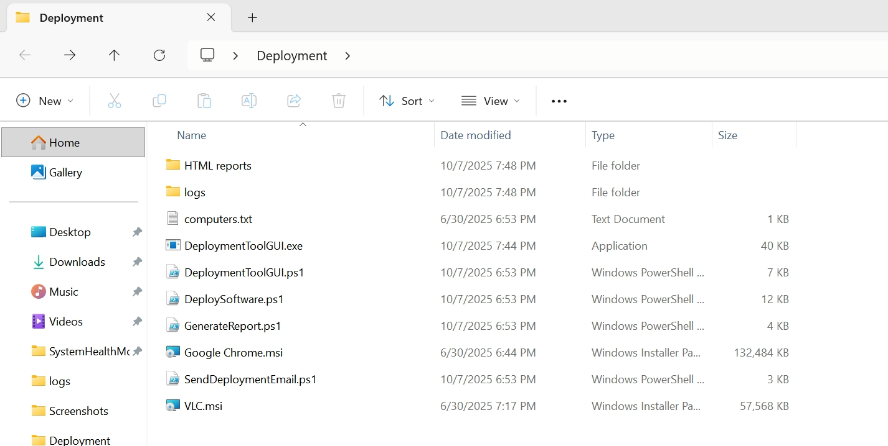
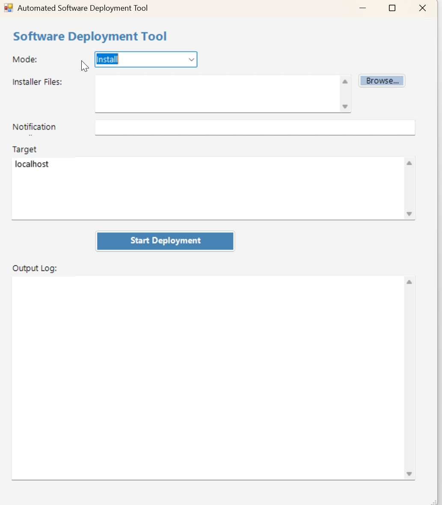
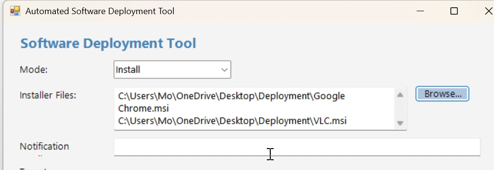
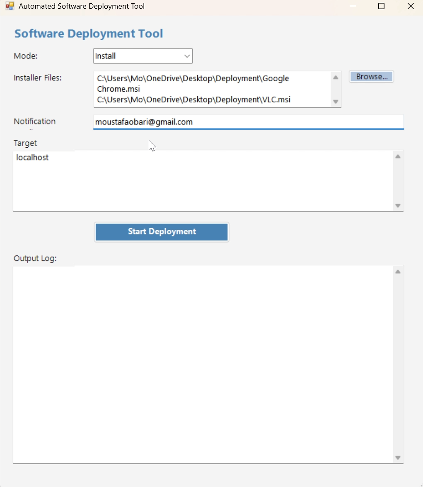
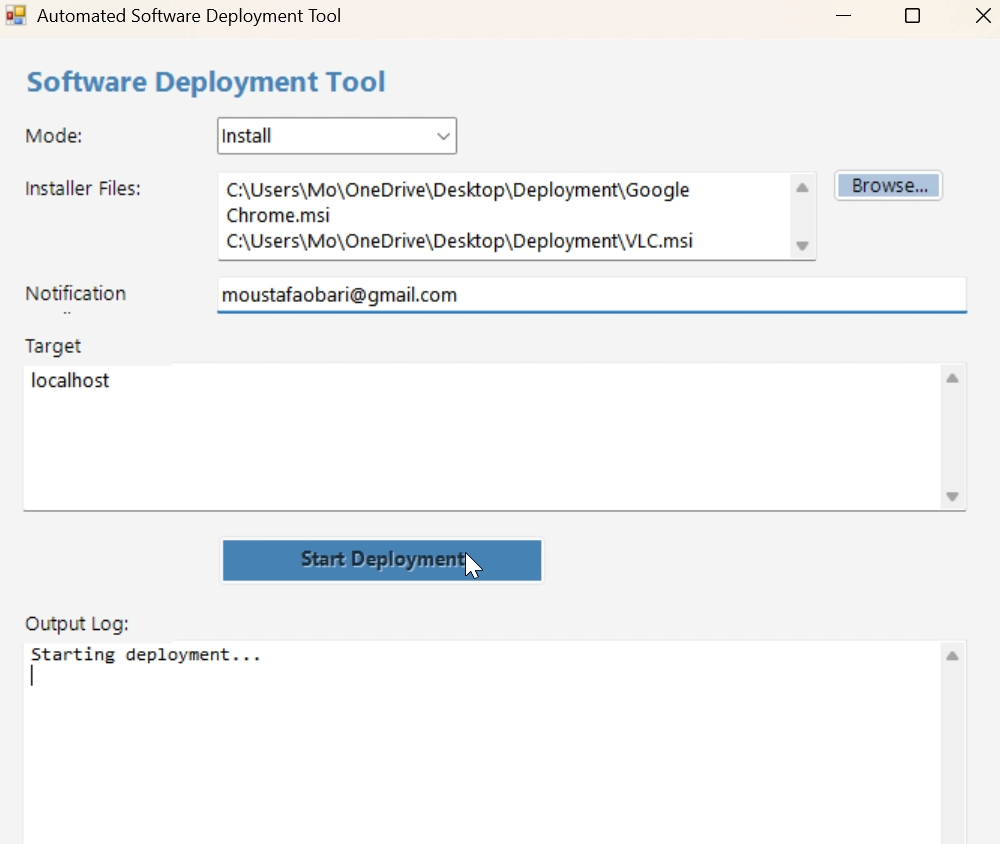
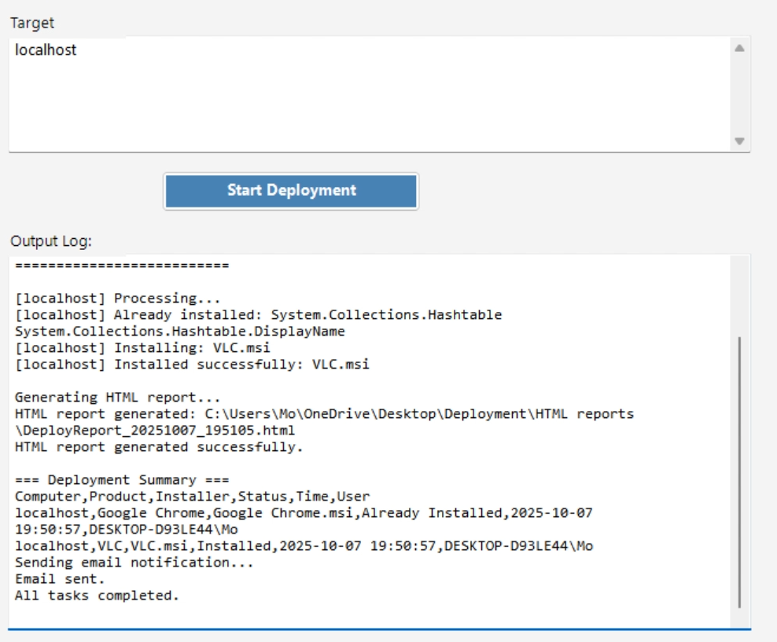
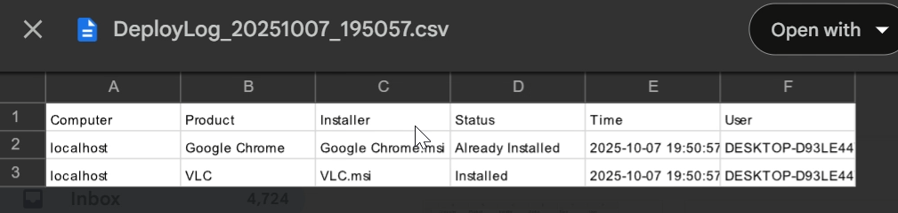
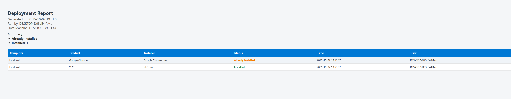
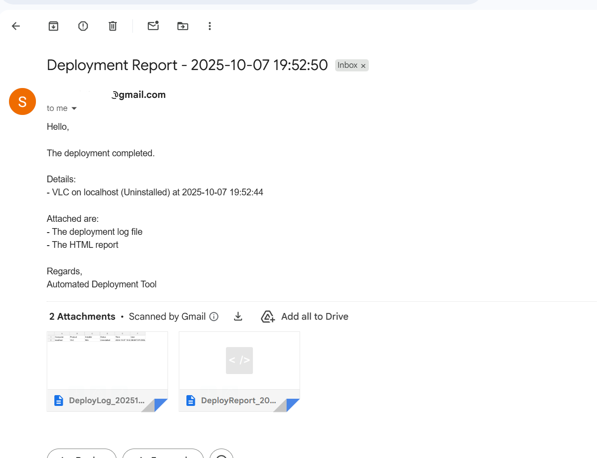

<a id="top"></a>

<p align="center">
  
</p>

<p align="center">
  <a href="https://github.com/MoustafaObari/SoftwareDeploymentTool">
    
  </a>
</p>

<h4 align="center">Shipping software shouldn’t be scary — it should be clear, auditable, and fast 🧩</h4>

<p align="center">
  <a href="#overview">Overview</a> • 
  <a href="#use-cases">Use Cases</a> • 
  <a href="#features">Features</a> • 
  <a href="#tech-stack">Tech Stack</a> • 
  <a href="#getting-started">Setup</a> • 
  <a href="#run-the-gui">Usage</a> • 
  <a href="#demo-video">Demo</a> • 
  <a href="#screenshots">Screenshots</a> • 
  <a href="#planned-enhancements">Enhancements</a> • 
  <a href="#developer">Developer</a>
</p>

---

<p align="center">
  
  
  
  
</p>

<p align="center">
  
  
</p>

---

## 🧠 Overview

**Built for IT admins, QA engineers, and DevOps teams to automate software lifecycles across multiple endpoints.**

**Software Deployment Tool** is a professional PowerShell + WinForms utility that simplifies software installation and removal. Whether you are deploying `.msi`/`.exe` packages silently or removing applications by product name, this tool ensures every action is tracked and reported.

It provides:
* **Silent Deployments:** Install or remove software without user interruption.
* **Audit-Ready Logs:** Automatically generates timestamped **HTML and CSV reports**.
* **Automated Notifications:** Securely emails results via SMTP.
* **Hybrid Control:** Use the interactive **GUI** for manual tasks or the **CLI** for automated pipelines.

---

## 💼 Ideal Use Cases

* 🖥️ **System Administrators** managing enterprise-wide rollouts.
* 🧰 **IT Support Teams** deploying tools across remote endpoints.
* 🧪 **QA Engineers** testing installer packages in isolated lab environments.
* 🏢 **Compliance Officers** needing repeatable, reportable deployment logs.

---

## ✨ Features

✅ **Silent Rollouts:** Deploy or remove MSI/EXE packages across multiple machines.
✅ **Smart Detection:** Automatically detects and skips already installed software.
✅ **Live Reporting:** Color-coded HTML and CSV logs generated for every run.
✅ **Email Integration:** Automated SMTP delivery of results with attachments.
✅ **Advanced Tracking:** Handles complex exit codes (0, 3010, 1605, etc.).
✅ **CLI Automation:** Perfect for Task Scheduler or CI/CD pipelines.

---

## 💻 Tech Stack

| Layer | Technology |
|-------|-------------|
| **Scripting & Automation** | PowerShell 5+ |
| **Interface** | Windows Forms (.NET) |
| **Reporting** | HTML / CSS |
| **Data Export** | CSV (Timestamped) |
| **Communication** | SMTP (Email Delivery) |

---

## ⚙️ Getting Started

### 🟦 1️⃣ Clone the Repository
```bash
git clone [https://github.com/MoustafaObari/SoftwareDeploymentTool.git](https://github.com/MoustafaObari/SoftwareDeploymentTool.git)  
cd SoftwareDeploymentTool
```

### 🟦 2️⃣ Configure SMTP (Optional)
Open `SendDeploymentEmail.ps1` and update your SMTP settings for automated reporting.

### 🟦 3️⃣ Define Target Machines
List your endpoints in **computers.txt**:
```text
localhost  
PC-01  
Server-05
```

---

## 🪟 Usage Modes

### **Option A: Interactive GUI**
Run the launcher to access the visual interface:
```powershell
powershell -ExecutionPolicy Bypass -File .\DeploymentToolGUI.ps1
```

### **Option B: Automation via CLI**
Ideal for scripting and remote execution:
```powershell
# Example: Silent Install
.\DeploySoftware.ps1 -Mode Install -InstallerPaths "C:\Apps\Chrome.msi" -Computers "localhost;PC-02"
```

---

<a id="demo-video"></a>
## 🎥 Demo Video

📺 Watch the tool in action:
🎬 [**Software Deployment Tool Demo**](https://github.com/MoustafaObari/SoftwareDeploymentTool/blob/main/Software%20deployment%20tool%20demo.mp4) 
*(Recorded live on Windows 11 — includes installation, uninstallation, and email reporting)*

---

<a id="screenshots"></a>
## 🖼️ Screenshots

| Folder Structure | Launch GUI | Select Installers |
|------------------|--------------|---------------|
|  |  |  |

| Ready (Email Config) | Start Deployment | Install Success |
|----------------|--------------|-----------------------|
|  |  |  |

| CSV Detailed Log | HTML Report View | Email Notification |
|------------------|------------------|--------------------|
|  |  |  |

---

## 📘 Screenshot Descriptions

| # | Screenshot | Description |
|---|-------------|-------------|
| 1 | Folder Structure | Project layout showing scripts, logs, and assets |
| 2 | Launch GUI | Main WinForms interface for mode and target selection |
| 3 | Selection | UI for browsing multiple installer files |
| 4 | Deployment | Live process tracking for remote/local installs |
| 5 | Reports | Detailed HTML and CSV logs generated post-run |
| 6 | Email | Sample SMTP notification with attached reports |

---

<a id="planned-enhancements"></a>
## 🧩 Planned Enhancements

* 🚀 **Parallel Execution:** Add multi-threaded remote execution for faster rollouts.
* 🔍 **Dry-Run Mode:** Preview deployment actions before execution.
* 📈 **Visual Analytics:** Add charts for success/failure statistics in reports.
* 💬 **Chat Integrations:** Support for Microsoft Teams and Slack webhooks.

---

<a id="developer"></a>
## 👨‍💻 Developer

**Moustafa Obari** Software Engineer • Cloud & Automation Enthusiast
📍 Toronto, Canada 🇨🇦

🔗 [GitHub](https://github.com/MoustafaObari) | [LinkedIn](https://linkedin.com/in/moustafaobari)
📧 [moustafaobari@gmail.com](mailto:moustafaobari@gmail.com)

---

<p align="center">
  
</p>

<p align="center">
  
</p>

<p align="center">
  © 2025 Moustafa Obari — crafted with 💙 PowerShell, Markdown, and strong coffee.
</p>

<p align="center">
  <a href="#top">⬆ Back to Top</a>
</p>
