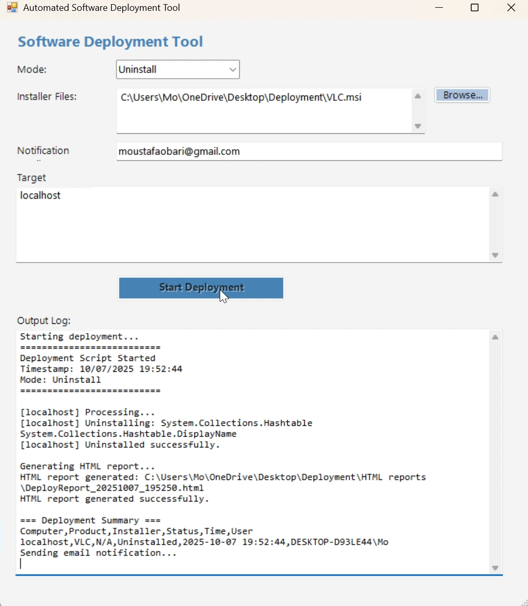
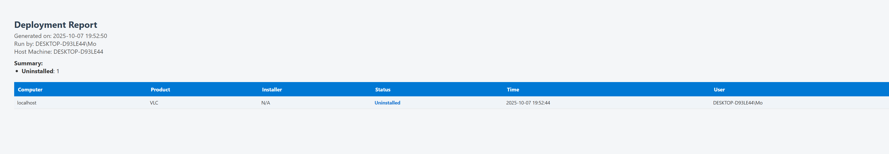

# 🚀 Software Deployment Tool

_A lightweight PowerShell + WinForms utility to automate software deployment and uninstallation across single or multiple machines — complete with live logs, HTML + CSV reports, and optional email notifications._

---

### 🔗 Quick Navigation
[Overview](#overview) • [Features](#features) • [Tech Stack](#tech-stack) • [Getting Started](#getting-started) • [Run the GUI](#run-the-gui) • [Automation via CLI](#automation-via-cli) • [Demo Video](#demo-video) • [Screenshots](#screenshots) • [Descriptions](#screenshot-descriptions) • [Planned Enhancements](#planned-enhancements) • [Developer](#developer) • [License](#license)

---

## 🧠 Overview

**Software Deployment Tool** simplifies software installation and removal for IT administrators.  
Choose **Install** to silently deploy `.msi` / `.exe` packages, or **Uninstall** to remove applications by **product name**.

Each deployment automatically generates timestamped **HTML and CSV reports**, and optionally emails them — perfect for **audit-ready, repeatable rollouts**.

> 💡 Designed for reliability, visibility, and simplicity in system administration.

Modern IT teams often spend hours manually managing software rollouts across many devices.  
This tool eliminates that complexity by automating every step — **reliably, visually, and fast**.

---

## ✨ Features

- 🚀 **Deploy or remove** MSI/EXE packages silently across multiple computers  
- 🧠 **Detect and skip** already installed software automatically  
- 📊 **Generate** HTML and CSV logs (color-coded and timestamped)  
- ✉️ **Send** deployment results via email (with attachments)  
- 💻 **Control** everything through a GUI or command-line interface  
- ⚙️ **Track exit codes** (handles 0, 3010, 1605, and more)  
- 🔒 **Exclude** logs and reports via `.gitignore`  
- 🔁 **Multi-target ready** (e.g., deploy to all hosts in `computers.txt`)

---

## 💻 Tech Stack

| Layer | Technology |
|------:|------------|
| Scripting | PowerShell 5+ |
| UI | Windows Forms (.NET) |
| Reporting | HTML + CSS |
| Email | SMTP |
| Logging | CSV + HTML (auto-timestamped) |

---

## ⚙️ Getting Started

### 1️⃣ Clone Repository
~~~bash
git clone https://github.com/MoustafaObari/SoftwareDeploymentTool.git
cd SoftwareDeploymentTool
~~~

### 2️⃣ (Optional) Configure Email
Open `SendDeploymentEmail.ps1` and update the SMTP configuration.  
Use a Gmail App Password or your internal SMTP relay credentials.

> ⚠️ Avoid storing real credentials in public repositories.

### 3️⃣ Define Targets
Edit `computers.txt` and list your machines (or use `localhost`):
~~~
localhost  
PC-01  
ServerA
~~~

---

## 🪟 Run the GUI

~~~powershell
# From the repository root
powershell -ExecutionPolicy Bypass -File .\DeploymentToolGUI.ps1
~~~

**Modes:**
- 🧩 **Install** → select one or more `.msi` / `.exe` files  
- 🧹 **Uninstall** → enter product names (e.g., `VLC;Google Chrome`)  
- ✉️ **Email** → optional recipient for auto-notifications  
- 🖥️ **Targets** → read from file or input manually  

After clicking **Start Deployment**, the tool runs your task and stores reports under:
- 📂 `HTML reports\`
- 📂 `logs\`

---

## ⚙️ Automation via CLI

You can run the tool directly from PowerShell for **scripting, scheduling, or remote automation** — without using the GUI.

💻 Click to view CLI examples

### 🧩 Install Software
~~~powershell
.\DeploySoftware.ps1 -Mode Install `
  -InstallerPaths "C:\Apps\Google Chrome.msi;C:\Apps\VLC.msi" `
  -Computers "localhost;PC-02"
~~~
Installs Google Chrome and VLC on multiple computers listed in the parameter.

---

### 🧹 Uninstall Software
~~~powershell
.\DeploySoftware.ps1 -Mode Uninstall `
  -InstallerPaths "VLC;Google Chrome" `
  -Computers "localhost;PC-02"
~~~
Uninstalls programs by **product name** (no installer file needed).

---

### 🧾 Generate a Report
~~~powershell
.\GenerateReport.ps1
~~~
Creates a new HTML and CSV summary report from the last deployment.

---

### ✉️ Email the Latest Report
~~~powershell
.\SendDeploymentEmail.ps1 -RecipientEmail you@example.com
~~~
Emails the last generated report using your configured SMTP settings.

---

## 🎥 Demo Video

> 🎞️ Recorded live on Windows 11 — includes installation, uninstallation, and automated email reporting.

---

## 🖼️ Screenshots

| Folder Structure | Launch GUI | Select Installers |
|---|---|---|
|  |  |  |

| Ready (Email filled) | Start Deployment | Install – Run & Success |
|---|---|---|
|  |  |  |

| Uninstall – Run & Success | CSV Log | HTML Report (Install) |
|---|---|---|
|  |  |  |

| HTML Report (Uninstall) | Email Notification |
|---|---|
|  |  |

---

## 📘 Screenshot Descriptions

| # | File | Description |
|--:|---|---|
| 1 | `01_Folder-Structure.png` | Project layout showing scripts, logs, reports, and screenshots |
| 2 | `02_Launch-GUI.png` | WinForms interface for mode, targets, and email |
| 3 | `03_Select-Installers.png` | Multiple installers selected for deployment |
| 4 | `04_Ready-With-Email.png` | Email recipient configured and ready to deploy |
| 5 | `05_Start-Deployment.png` | Deployment process running live |
| 6 | `06_Install-Run-And-Success.png` | Completed install summary |
| 7 | `07_Uninstall-Run-And-Success.png` | Successful uninstall confirmation |
| 8 | `08_DeployLog-CSV.png` | CSV log showing timestamps, results, and targets |
| 9 | `09_HTML-Report-Install.png` | HTML report (install results) |
| 10 | `10_HTML-Report-Uninstall.png` | HTML report (uninstall results) |
| 11 | `11_Email-Notification.png` | Email notification with attached reports |

---

## 🧩 Planned Enhancements

### 🚀 Next Iteration
- Add **parallel remote execution** for faster rollouts  
- Introduce **dry-run mode** (preview before execution)  

### 📊 Reporting Improvements
- Add **visual charts** for install/uninstall stats  

### 💬 Integrations
- Support **Teams/Slack notifications**  
- Publish demo assets via **GitHub Releases / LFS**

---

## 👨‍💻 Developer

**Moustafa Obari**  
Software Engineer • Cloud & Automation Enthusiast  

> *Building reliable automation tools that make IT operations effortless.*

🔗 [GitHub Profile](https://github.com/MoustafaObari)  
🔗 [LinkedIn Profile](https://www.linkedin.com/in/moustafaobari)

---

## 📄 License (MIT)

~~~text
MIT License

Copyright (c) 2025 Moustafa Obari

Permission is hereby granted, free of charge, to any person obtaining a copy
of this software and associated documentation files (the "Software"), to deal
in the Software without restriction, including without limitation the rights  
to use, copy, modify, merge, publish, distribute, sublicense, and/or sell  
copies of the Software, and to permit persons to whom the Software is  
furnished to do so, subject to the following conditions:

The above copyright notice and this permission notice shall be included in all  
copies or substantial portions of the Software.

THE SOFTWARE IS PROVIDED "AS IS", WITHOUT WARRANTY OF ANY KIND, EXPRESS OR  
IMPLIED, INCLUDING BUT NOT LIMITED TO THE WARRANTIES OF MERCHANTABILITY,  
FITNESS FOR A PARTICULAR PURPOSE AND NONINFRINGEMENT. IN NO EVENT SHALL THE  
AUTHORS OR COPYRIGHT HOLDERS BE LIABLE FOR ANY CLAIM, DAMAGES OR OTHER  
LIABILITY, WHETHER IN AN ACTION OF CONTRACT, TORT OR OTHERWISE, ARISING FROM,  
OUT OF OR IN CONNECTION WITH THE SOFTWARE OR THE USE OR OTHER DEALINGS IN THE  
SOFTWARE.
~~~

---

> 💬 “Shipping software to many machines shouldn’t be scary — with this tool, it’s clear, auditable, and fast.”

[⬆ Back to Top](#top)
