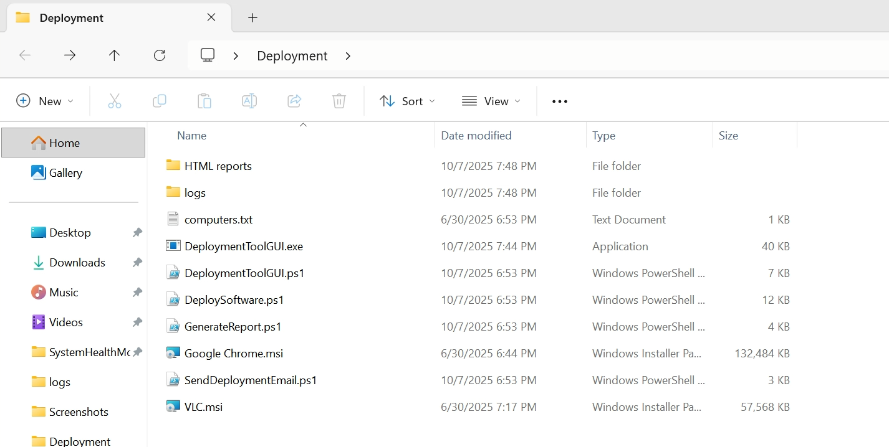
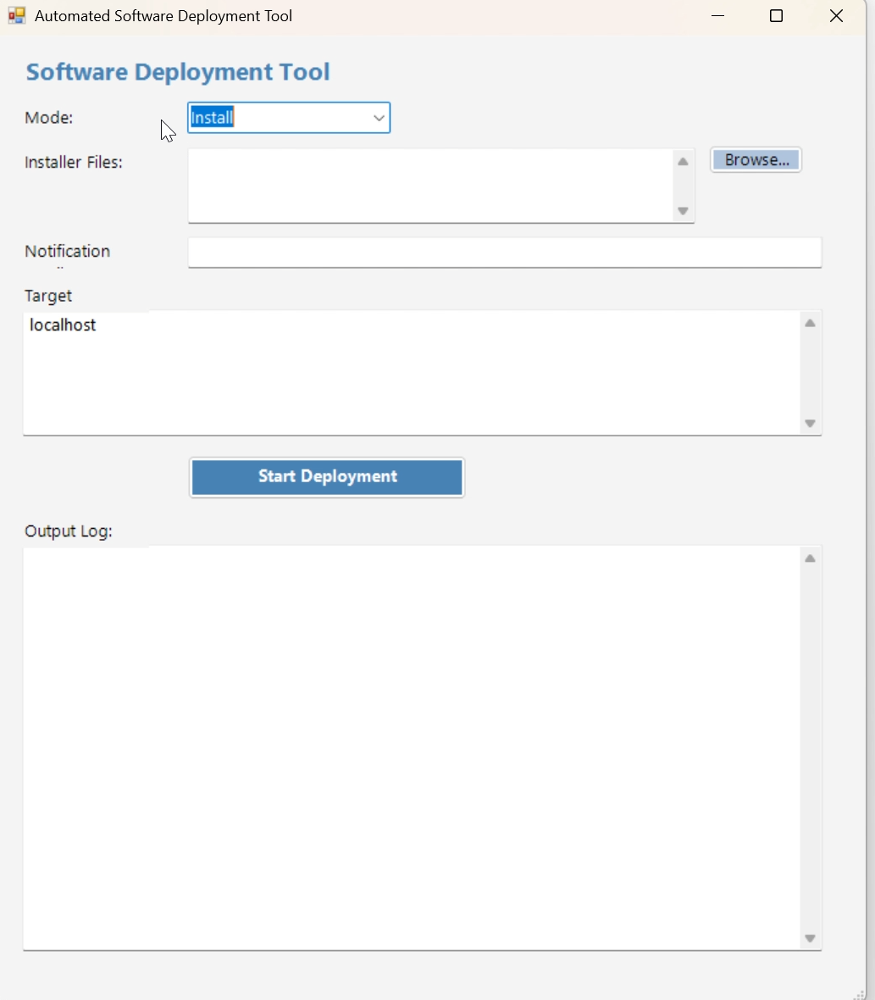
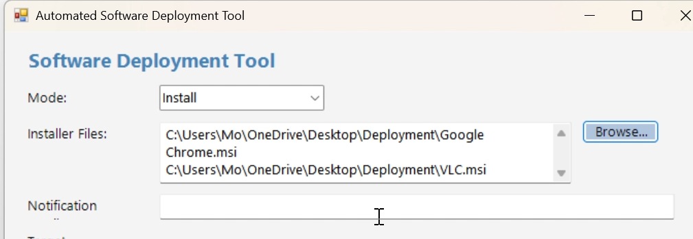
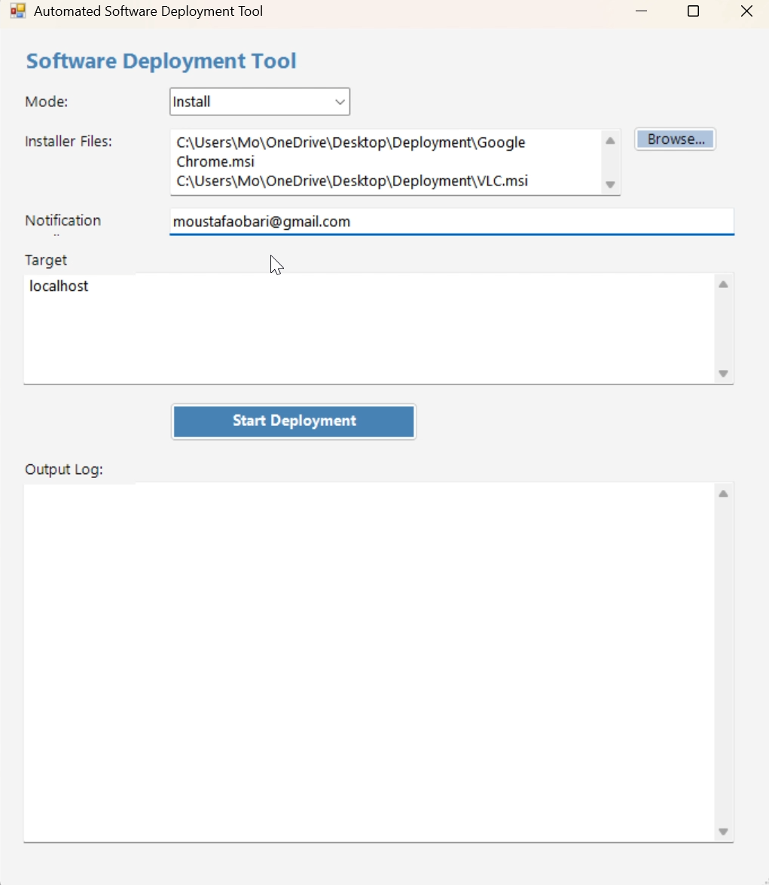
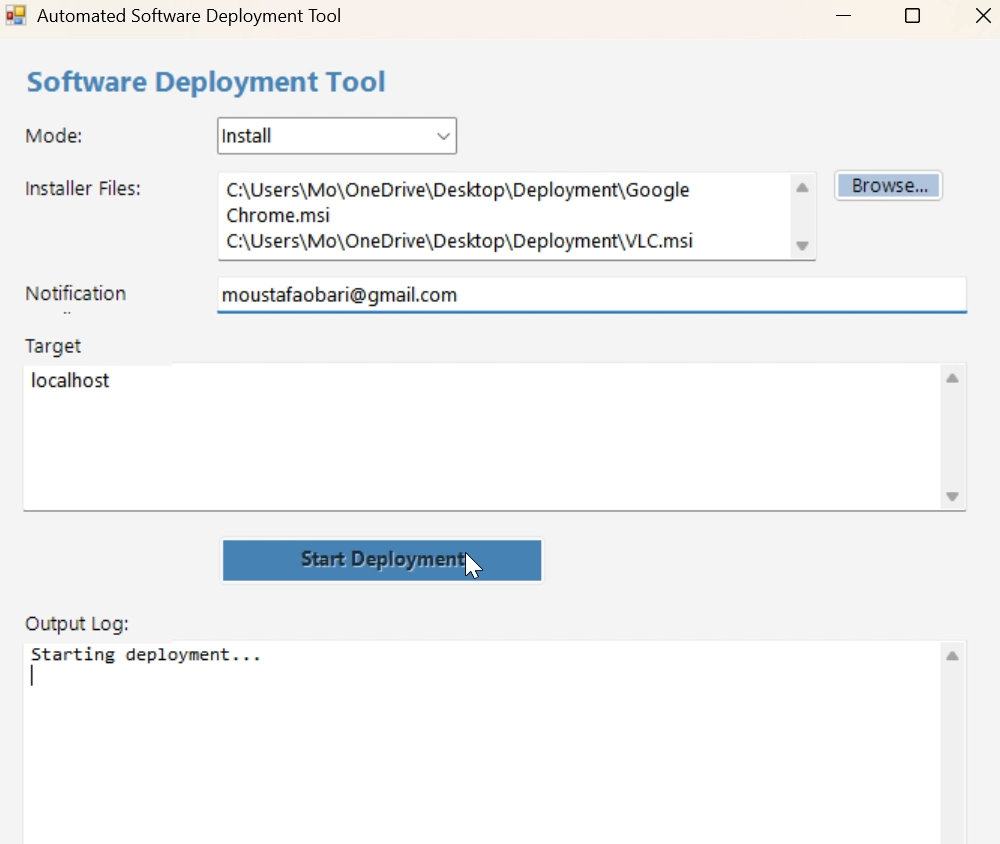
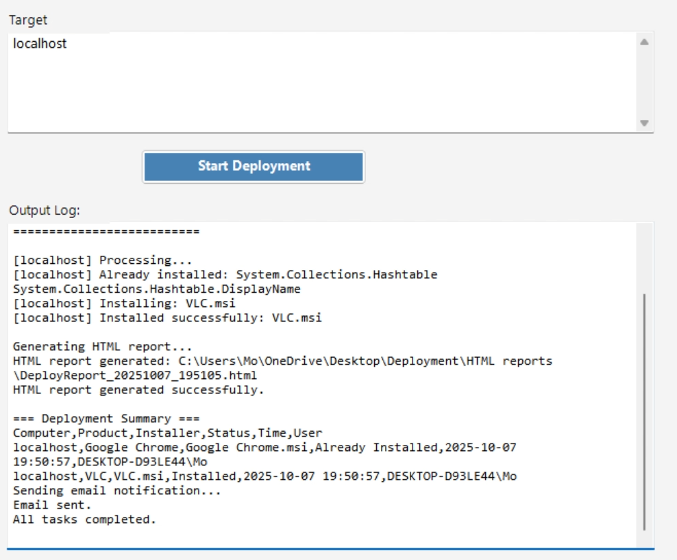
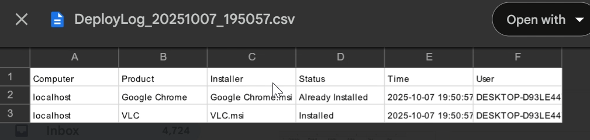
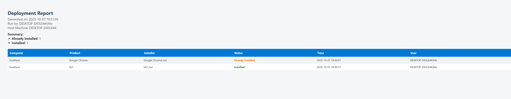
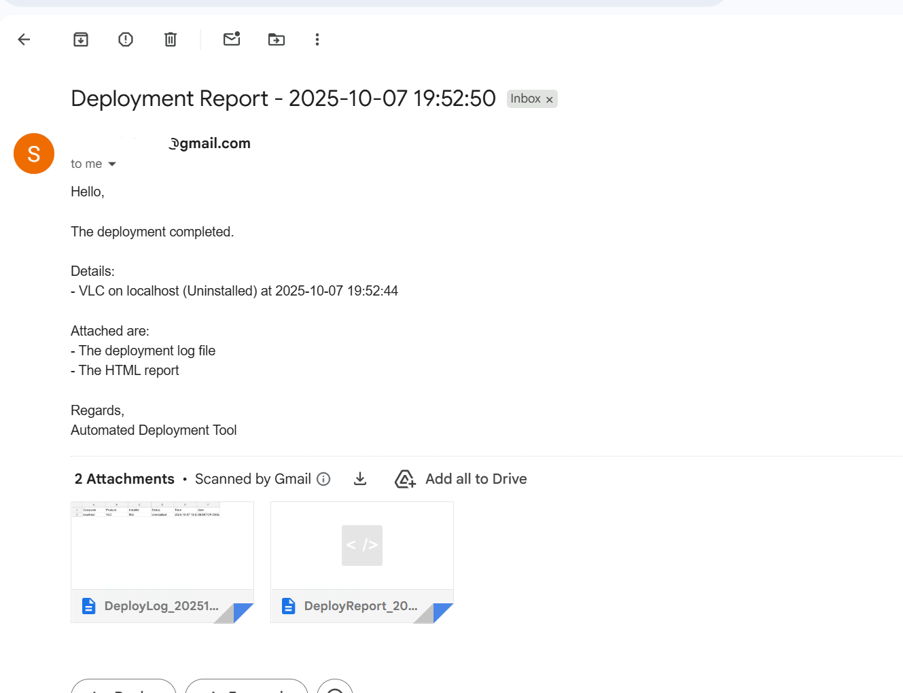

<a id="top"></a>

<p align="center">
  
</p>

<p align="center">
  <a href="https://github.com/MoustafaObari/SoftwareDeploymentTool">
    
  </a>
</p>

<h4 align="center">PowerShell-based endpoint deployment automation for clear, auditable, and technician-friendly software support 🧩</h4>

<p align="center">
  <a href="#overview">Overview</a> • 
  <a href="#use-cases">Use Cases</a> • 
  <a href="#features">Features</a> • 
  <a href="#tech-stack">Tech Stack</a> • 
  <a href="#deployment-workflow">Workflow</a> • 
  <a href="#getting-started">Setup</a> • 
  <a href="#usage-modes">Usage</a> • 
  <a href="#demo-video">Demo</a> • 
  <a href="#screenshots">Screenshots</a> • 
  <a href="#support-workflow">Support Workflow</a> • 
  <a href="#validation-evidence">Validation</a> • 
  <a href="#security-design-and-scope-control">Security</a> • 
  <a href="#planned-enhancements">Enhancements</a> • 
  <a href="#developer">Developer</a>
</p>

---

<p align="center">
  
  
  
  
  
</p>

<p align="center">
  
  
  
  
</p>

---

<a id="overview"></a>

## 🧠 Overview

**Software Deployment Tool** is a PowerShell-based endpoint support utility designed to simplify silent software installation, uninstallation, logging, and reporting across Windows machines.

This project was built around a practical IT Support / Desktop Support scenario:

> A technician needs a repeatable way to deploy or remove software, track what happened, generate logs, and provide clear evidence after the task is complete.

The project demonstrates how PowerShell can be used to turn repetitive endpoint tasks into a structured support workflow with a simple GUI, repeatable script execution, and support-ready documentation.

It provides:

- **Silent MSI/EXE Deployment:** Install software packages with reduced user interruption.
- **Uninstall Workflows:** Remove applications using repeatable PowerShell logic.
- **Install-State Checks:** Track whether deployment actions completed successfully.
- **Audit-Ready Logs:** Generate timestamped CSV and HTML reports.
- **Technician-Friendly GUI:** Use a Windows Forms interface for manual support tasks.
- **CLI Support:** Run deployment actions through PowerShell for repeatable automation.
- **Optional Email Reporting:** Send deployment results through SMTP when configured.

---

<a id="use-cases"></a>

## 💼 Use Cases

| Use Case | What This Project Demonstrates |
|---|---|
| **IT Support / Help Desk** | Deploy or remove common tools while documenting what was changed. |
| **Desktop Support** | Run technician-friendly software installation workflows from a GUI. |
| **Endpoint Support** | Validate installation results and generate evidence for support handoff. |
| **Software Troubleshooting** | Review install/uninstall output, exit codes, logs, and reports. |
| **Internal IT Documentation** | Create repeatable steps, screenshots, and usage notes for future technicians. |
| **Lab Validation** | Test installer behavior before wider deployment or documentation. |

---

<a id="features"></a>

## ✨ Features

✅ **Silent Rollouts:** Deploy or remove MSI/EXE packages across target machines.  
✅ **Smart Detection:** Detects and skips software that is already installed when applicable.  
✅ **Live Reporting:** Generates HTML and CSV logs for review and documentation.  
✅ **Email Reporting:** Optional SMTP notification with report attachments.  
✅ **Exit Code Tracking:** Handles deployment result codes such as `0`, `3010`, and common installer responses.  
✅ **GUI-Based Workflow:** Windows Forms interface for technician-friendly use.  
✅ **CLI Automation:** Can be used for repeatable PowerShell-based deployment workflows.  
✅ **Support Evidence:** Screenshots, logs, reports, and demo video are included for portfolio review.  

---

<a id="tech-stack"></a>

## 💻 Tech Stack

| Layer | Technology |
|---|---|
| **Scripting & Automation** | PowerShell 5.1+ |
| **Interface** | Windows Forms (.NET) |
| **Deployment Targets** | Windows endpoints |
| **Reporting** | HTML / CSS |
| **Data Export** | CSV |
| **Communication** | SMTP Email Delivery |
| **Packaging / Execution** | PowerShell scripts, optional executable workflow |
| **Documentation** | Markdown, screenshots, demo video |

---

<a id="deployment-workflow"></a>

## 🧭 Deployment Workflow

```text
Technician / Support User
        |
        v
Launch GUI or PowerShell Script
        |
        v
Select Install / Uninstall Mode
        |
        v
Select Installer or Application Target
        |
        v
Read Target Machines
        |
        v
Run Deployment or Removal Workflow
        |
        v
Capture Result, Exit Code, and Status
        |
        v
Generate CSV Log and HTML Report
        |
        v
Optional Email Notification
        |
        v
Support Evidence and Handoff
```

| Phase | Purpose |
|---|---|
| **Prepare Installer** | Select the MSI/EXE package that needs to be deployed or removed. |
| **Select Targets** | Define local or remote endpoints through `computers.txt` or script parameters. |
| **Run Deployment** | Launch the GUI or PowerShell script to perform the install/uninstall task. |
| **Validate Result** | Review install status, exit codes, and generated logs. |
| **Generate Evidence** | Produce CSV and HTML reports for documentation and handoff. |
| **Notify Support Team** | Optionally send results through SMTP email reporting. |

---

<a id="repository-structure"></a>

## 📁 Repository Structure

```text
SoftwareDeploymentTool/
│
├── README.md
├── LICENSE
├── .gitignore
│
├── DeploySoftware.ps1
├── DeploymentToolGUI.ps1
├── GenerateReport.ps1
├── SendDeploymentEmail.ps1
│
├── computers.txt
├── config.json
│
└── Screenshots/
    ├── 01_Folder-Structure.png
    ├── 02_Launch-GUI.png
    ├── 03_Select-Installers.png
    ├── 04_Ready-With-Email.png
    ├── 05_Start-Deployment.png
    ├── 06_Install-Run-And-Success.png
    ├── 08_DeployLog-CSV.png
    ├── 09_HTML-Report-Install.png
    └── 11_Email-Notification.png
```

Generated reports and runtime logs should remain local and should not include production secrets, company endpoint data, or private credentials.

---

<a id="getting-started"></a>

## ⚙️ Getting Started

### 🟦 1️⃣ Clone the Repository

```bash
git clone https://github.com/MoustafaObari/SoftwareDeploymentTool.git
cd SoftwareDeploymentTool
```

### 🟦 2️⃣ Configure SMTP Optional Email Reporting

Open `SendDeploymentEmail.ps1` and update your SMTP settings if you want automated email reports.

Do not commit real SMTP usernames, passwords, app passwords, tokens, or production credentials.

### 🟦 3️⃣ Define Target Machines

List your endpoints in `computers.txt`:

```text
localhost
PC-01
Server-05
```

For a lab demo, `localhost` is enough to validate the workflow.

---

<a id="usage-modes"></a>

## 🪟 Usage Modes

### Option A: Interactive GUI

Run the launcher to access the visual interface:

```powershell
powershell -ExecutionPolicy Bypass -File .\DeploymentToolGUI.ps1
```

### Option B: Automation via CLI

Use the deployment script directly for repeatable support workflows:

```powershell
.\DeploySoftware.ps1 -Mode Install -InstallerPaths "C:\Apps\Chrome.msi" -Computers "localhost;PC-02"
```

### Option C: Uninstall Workflow

Use the same support concept to remove an application when the uninstall logic is configured:

```powershell
.\DeploySoftware.ps1 -Mode Uninstall -AppName "Example Application" -Computers "localhost"
```

---

<a id="demo-video"></a>

## 🎥 Demo Video

📺 Watch the tool in action:

🎬 [**Software Deployment Tool Demo**](https://github.com/MoustafaObari/SoftwareDeploymentTool/blob/main/Software%20deployment%20tool%20demo.mp4)

*Recorded live on Windows 11 and demonstrates installation, uninstallation, logging, and email reporting.*

---

<a id="screenshots"></a>

## 🖼️ Screenshots

| Folder Structure | Launch GUI | Select Installers |
|---|---|---|
|  |  |  |

| Ready Email Config | Start Deployment | Install Success |
|---|---|---|
|  |  |  |

| CSV Detailed Log | HTML Report View | Email Notification |
|---|---|---|
|  |  |  |

---

<a id="screenshot-descriptions"></a>

## 📘 Screenshot Descriptions

| # | Screenshot | Description |
|---|---|---|
| 1 | Folder Structure | Shows the project layout, scripts, logs, and assets. |
| 2 | Launch GUI | Shows the main Windows Forms interface for deployment mode and target selection. |
| 3 | Select Installers | Shows installer file selection for deployment. |
| 4 | Ready Email Config | Shows the email reporting configuration step. |
| 5 | Start Deployment | Shows the deployment workflow starting from the GUI. |
| 6 | Install Success | Shows successful software deployment output. |
| 7 | CSV Detailed Log | Shows timestamped deployment results in CSV format. |
| 8 | HTML Report View | Shows the generated HTML deployment report. |
| 9 | Email Notification | Shows an SMTP email notification with report output. |

---

<a id="support-workflow"></a>

## 🧪 Support Workflow

This project follows a practical endpoint support workflow that a technician could use when deploying or removing software in a lab or small support environment.

| Step | Technician Action | Support Value |
|---|---|---|
| **1. Identify Need** | Determine whether software needs to be installed, removed, or validated. | Creates a clear support objective before running tools. |
| **2. Prepare Package** | Select the MSI/EXE installer or uninstall target. | Ensures the correct package is used. |
| **3. Select Endpoint** | Define target machines in `computers.txt` or script parameters. | Keeps deployment scope controlled. |
| **4. Run Tool** | Use the GUI or CLI workflow. | Supports both manual and repeatable execution. |
| **5. Review Output** | Check console output, generated CSV, and HTML report. | Confirms success, failure, or skipped actions. |
| **6. Document Result** | Save reports and screenshots as evidence. | Supports handoff and future troubleshooting. |
| **7. Notify Stakeholders** | Send optional email report if SMTP is configured. | Makes deployment results easier to share. |

---

<a id="validation-evidence"></a>

## ✅ Validation Evidence

The project includes screenshots and output evidence showing the tool working end-to-end.

| Evidence Area | What Was Captured | Why It Matters |
|---|---|---|
| **Folder Structure** | Project files, scripts, logs, and assets | Shows the tool is organized and repeatable. |
| **GUI Launch** | Windows Forms interface loading successfully | Confirms technician-friendly operation. |
| **Installer Selection** | MSI/EXE selection workflow | Shows the tool can handle deployment inputs. |
| **Deployment Run** | PowerShell deployment execution | Confirms the tool performs the intended task. |
| **CSV Log Output** | Timestamped deployment result log | Provides audit-ready support evidence. |
| **HTML Report** | Browser-readable deployment summary | Makes results easier to review and share. |
| **Email Notification** | SMTP notification with report output | Demonstrates optional automated reporting. |

---

<a id="security-design-and-scope-control"></a>

## 🔐 Security Design and Scope Control

### Why this project uses a controlled lab workflow

This project is designed as a support automation lab, not a production enterprise deployment platform. In real environments, software deployment should follow approved change management, endpoint security, and access control procedures.

The safer design choices are:

- ✅ Use a controlled list of target machines.
- ✅ Keep credentials and SMTP secrets out of the repository.
- ✅ Generate local logs and reports for review.
- ✅ Use PowerShell execution intentionally instead of hiding actions.
- ✅ Document install results for troubleshooting and support handoff.
- ✅ Avoid claiming production-scale deployment without enterprise tools.

### What this project proves

- The tool can launch from a GUI.
- A technician can select installers and target machines.
- Deployment actions can be logged.
- HTML and CSV reports can be generated.
- Email reporting can be integrated.
- The workflow is repeatable and documentable.

### What this project does not claim

- It is not a replacement for Microsoft Intune, SCCM, or enterprise RMM tools.
- It does not store production credentials.
- It does not include real company endpoints.
- It does not bypass endpoint security controls.
- It does not claim production deployment at enterprise scale.

---

<a id="what-i-learned"></a>

## 🧠 What I Learned

This project strengthened my understanding of:

- PowerShell scripting for endpoint support tasks.
- Silent MSI/EXE installation and uninstall workflows.
- Windows Forms GUI design for technician-friendly tools.
- CSV logging for repeatable support evidence.
- HTML report generation for clear documentation.
- SMTP email reporting for automated notifications.
- Exit code handling and deployment troubleshooting.
- Structuring scripts so support workflows are easier to repeat.
- Writing GitHub documentation that explains both the tool and the support value.

---

<a id="resume-summary-version"></a>

## 📄 Resume Summary Version

Built a PowerShell-based software deployment utility for silent MSI/EXE installs, uninstall workflows, install-state checks, logging, SMTP email notifications, and HTML reporting. Packaged the tool with a Windows Forms GUI to demonstrate technician-friendly endpoint support automation, repeatable troubleshooting, and audit-ready documentation.

---

<a id="skills-demonstrated"></a>

## 🎯 Skills Demonstrated

| Category | Skills |
|---|---|
| **PowerShell Automation** | Scripted install/uninstall workflows, parameters, logging, and execution handling |
| **Desktop Support** | Software installation, uninstall support, endpoint readiness checks |
| **Windows Support** | Windows Forms GUI, local machine testing, installer execution |
| **Reporting** | CSV logs, HTML reports, timestamped output, support evidence |
| **Troubleshooting** | Exit code review, install-state checks, deployment validation |
| **Documentation** | README, screenshots, usage instructions, demo evidence |
| **Support Handoff** | Clear logs and reports for review by another technician or support team |

---

<a id="planned-enhancements"></a>

## 🧩 Planned Enhancements

- 🚀 Add parallel execution for faster multi-endpoint rollouts.
- 🔍 Add dry-run mode to preview deployment actions before execution.
- 📈 Add visual charts for success and failure statistics in reports.
- 💬 Add Microsoft Teams or Slack webhook notifications.
- 🧾 Add more detailed install-state validation before and after deployment.
- 🔐 Add safer configuration handling for SMTP settings through environment variables.

---

<a id="developer"></a>

## 👨‍💻 Developer

**Moustafa Obari**  
IT Support Specialist | PowerShell Automation | Microsoft 365 / Entra / Intune  
📍 Toronto, Canada

🔗 [GitHub](https://github.com/MoustafaObari) | [LinkedIn](https://linkedin.com/in/moustafaobari)  
📧 [moustafaobari@gmail.com](mailto:moustafaobari@gmail.com)

---

<p align="center">
  
</p>

<p align="center">
  
</p>

<p align="center">
  © 2025 Moustafa Obari — crafted with 💙 PowerShell, Markdown, and strong coffee.
</p>

<p align="center">
  <a href="#top">⬆ Back to Top</a>
</p>
